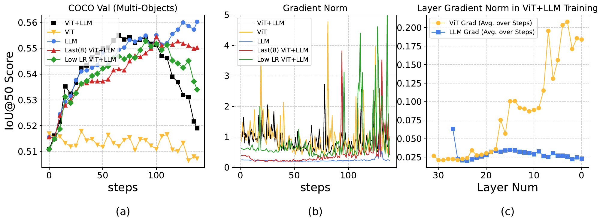

## Fig. A. Vision-Encoder Training Ablation for Reviewers 3BJa W3/Q3 and d7C3 Q1

## Table B. Gradient-Interference Diagnostic for Reviewer TZTQ W1

### Table B1. Summary

Setup: 512 examples per task, 3 data-sampling seeds, one no-update GRPO backward pass, last-4 LLM self-attention q/k/v/o blocks.

| Checkpoint | Reasoning-vs-Perception Mean | Median | Negative Pairs (<0) | Negative Pairs (<-0.01) |
|---|---:|---:|---:|---:|
| Qwen2.5-VL-7B | -0.0028 | -0.0098 | 9/16 | 8/16 |
| Orsta-7B | 0.0134 | 0.0080 | 3/16 | 2/16 |

### Table B2. Qwen2.5-VL-7B Reasoning-vs-Perception Gradient Cosine

| reasoning \ perception | detection | grounding | ocr | counting |
|---|---:|---:|---:|---:|
| math | -0.0262 | 0.0120 | -0.0205 | -0.0092 |
| puzzle | 0.0087 | 0.0031 | -0.0442 | 0.0388 |
| chart | -0.0350 | -0.0119 | -0.0103 | 0.0064 |
| science | 0.0144 | -0.0243 | 0.1022 | -0.0487 |

### Table B3. Orsta-7B Reasoning-vs-Perception Gradient Cosine

| reasoning \ perception | detection | grounding | ocr | counting |
|---|---:|---:|---:|---:|
| math | 0.0216 | 0.0184 | 0.0463 | 0.0594 |
| puzzle | -0.0251 | 0.0079 | -0.0294 | 0.0073 |
| chart | 0.0198 | 0.0080 | -0.0013 | 0.0103 |
| science | 0.0015 | 0.0074 | 0.0055 | 0.0570 |
